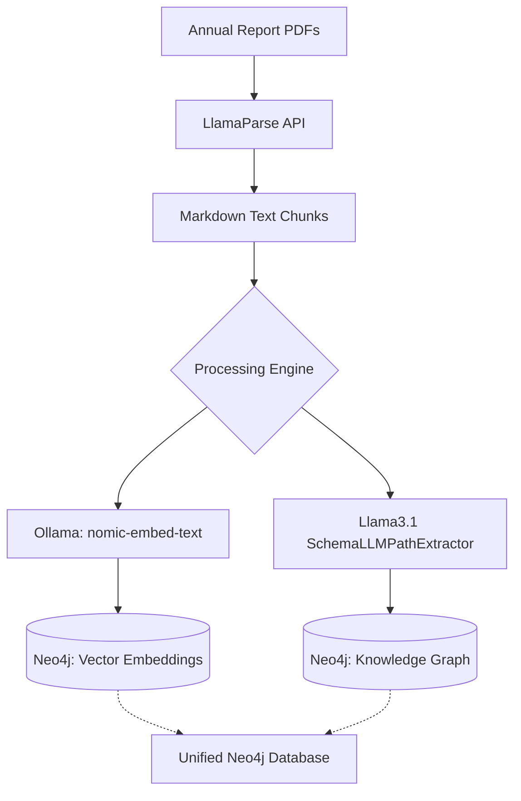
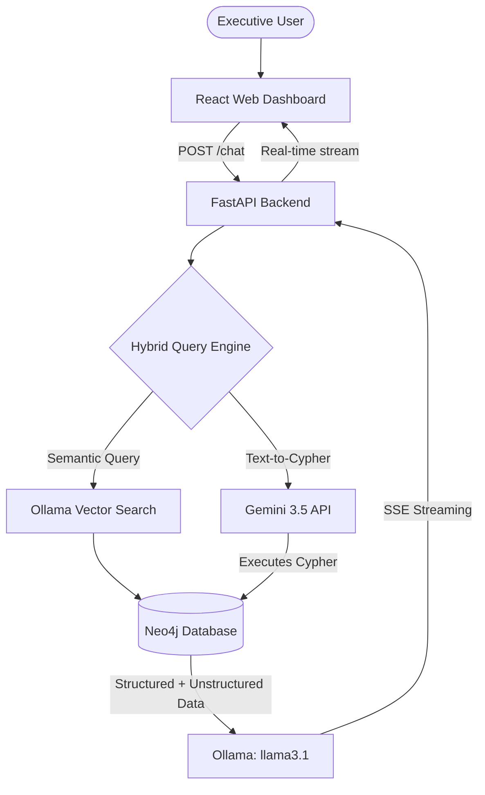

# Tata_Ratan: Enterprise Hybrid GraphRAG System

Tata_Ratan is a fully local, zero-hallucination Enterprise GraphRAG (Retrieval-Augmented Generation) dashboard. It is designed to expertly navigate and query Tata Steel's massive 582-page 119th Annual Report (FY2025-26).

By combining the deterministic precision of a Knowledge Graph with the semantic understanding of Vector Embeddings, Tata_Ratan can seamlessly answer both hyper-specific structural questions (e.g., financial metrics, plant capacities) and highly nuanced strategic questions (e.g., ESG goals, carbon neutrality).

## 🏗️ High-Level Architecture

The system uses a robust hybrid architecture, combining the raw analytical power of local LLMs with Google's cloud APIs for structured reasoning:
- **Framework:** LlamaIndex & FastAPI
- **Frontend:** React + Vite (Corporate Light Mode)
- **Database:** Neo4j (Unified Graph & Vector Store)
- **Synthesis LLM:** `llama3.1` (8B) via Ollama
- **Cypher Generation:** Gemini 3.5 Flash API
- **Embeddings:** `nomic-embed-text` via Ollama

### 1. Ingestion Pipeline (`backend/ingest.py`)
Because the annual report is massive, the ingestion pipeline is designed for fault tolerance and deep extraction using an Open Ontology:



- **Open Ontology Extraction:** Using a custom extractor, the pipeline dynamically extracts exact financial entities (`COMPANY`, `FINANCIAL_METRIC`, `PLANT`, `ASSET`) and relationships (`REPORTED`, `OWNS_ASSET`). 
- **Unified Storage:** Both the structured Knowledge Graph entities and the unstructured text chunks (with their vector embeddings) are upserted into Neo4j.

### 2. Hybrid Query Engine & Web UI (`backend/api.py` & `frontend/`)
To prevent the hallucinations common with local models writing Cypher, Tata_Ratan delegates graph-traversal to Gemini, while keeping synthesis local:



* **Text-To-Cypher (Gemini):** Gemini 3.5 Flash is highly adept at writing syntactically perfect Cypher code. It maps the user's question to the Neo4j schema and pulls the exact data required.
* **Vector Fallback:** Simultaneously, local `nomic-embed-text` hunts down the exact paragraphs from the PDF that contain semantic similarity to the question.
* **Synthesis:** The retrieved context is handed to local `llama3.1`, which synthesizes a highly accurate response and streams it via Server-Sent Events (SSE) back to the React UI, while a custom CSS Excavator animation entertains the user.

---

## 📂 Project Structure

```text
tata_ratan/
├── backend/                  # Core AI logic and Neo4j scripts
│   ├── api.py                # FastAPI Streaming Server
│   ├── ingest.py             # Knowledge graph extraction & embedding
│   └── query.py              # Hybrid query engine configuration
├── frontend/                 # React Web Application
│   ├── src/                  # React Components & CSS (App, Excavator)
│   └── package.json          # Node dependencies
├── data/                     # Source documents
│   └── raw/                  # Original PDFs
├── logs/                     # Application & Error logs
└── .venv/                    # Python virtual environment
```

---

## 🚀 Setup & Usage Guide

### Prerequisites
1. **Neo4j Desktop:** Ensure Neo4j is installed and running locally on `bolt://localhost:7687`.
2. **Ollama:** Ensure Ollama is running with the required models pulled:
   ```bash
   ollama run llama3.1
   ollama pull nomic-embed-text
   ```

### Step 1: Environment Variables
You MUST export these three secrets in every terminal you use:
```bash
export NEO4J_PASSWORD="YOUR_BRAND_NEW_PASSWORD"
export LLAMA_CLOUD_API_KEY="YOUR_BRAND_NEW_API_KEY"
export GEMINI_API_KEY="YOUR_BRAND_NEW_GEMINI_KEY"
```

### Step 2: The "Brain" (FastAPI Backend)
Open **Terminal 1**, activate your `.venv`, export your keys, and start the API:
```bash
source .venv/bin/activate
export NEO4J_PASSWORD="YOUR_BRAND_NEW_PASSWORD"
export LLAMA_CLOUD_API_KEY="YOUR_BRAND_NEW_API_KEY"
export GEMINI_API_KEY="YOUR_BRAND_NEW_GEMINI_KEY"

python3 backend/api.py
```

### Step 3: The "Face" (React Frontend)
Open **Terminal 2**, navigate to the frontend folder, and start the Vite dev server:
```bash
cd frontend
npm install
npm run dev
```
Navigate to `http://localhost:5173` in your browser to access the Executive Dashboard!

---

## 💡 Important Tips & Troubleshooting

1. **Two Terminals Required:** You *must* run the FastAPI backend (`api.py`) and the React frontend (`npm run dev`) simultaneously in two completely separate terminal windows. If you close either terminal, the app will break.
2. **Environment Variables Reset:** On Mac, every time you open a *new* terminal tab or window, your exported variables are forgotten. Always remember to `export GEMINI_API_KEY="..."` before running the backend in a fresh terminal!
3. **Gemini Free Tier Rate Limits:** If you are using the free tier of the Gemini API, Google limits you to a certain number of requests per minute (usually around 20). If you ask too many questions too fast and see a "Connection Error" or 500 Error, simply wait about 30 seconds for the quota to reset and try again!
4. **Interactive CLI Mode:** Don't want the Web UI? You can skip the frontend entirely. Just run `python3 backend/query.py` in your terminal to get the classic, hacker-style streaming chat prompt directly in your console!
