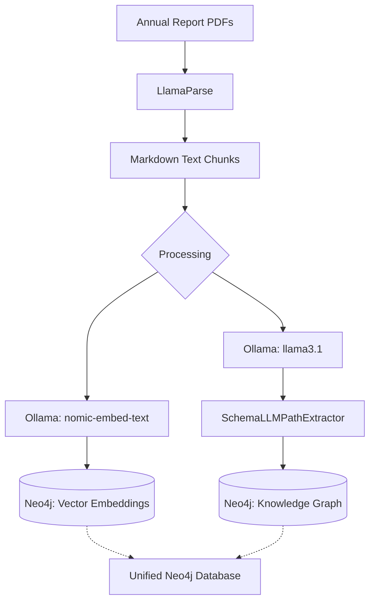
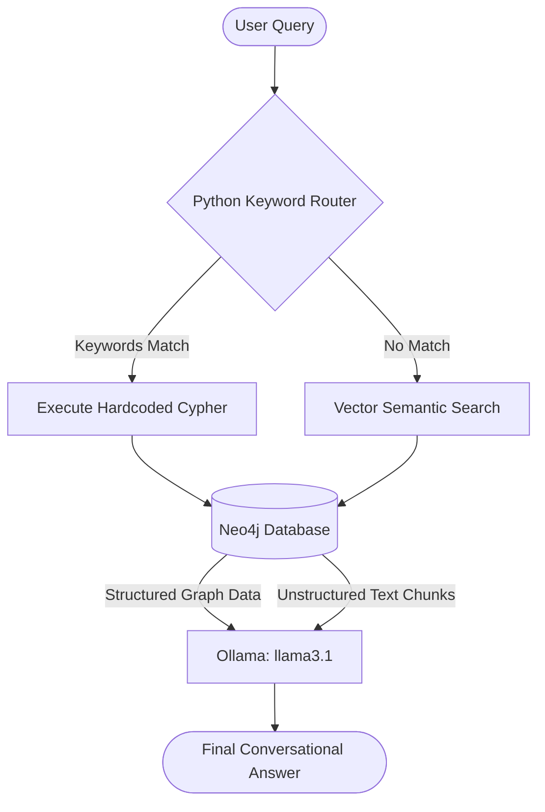

# Tata_Ratan: Enterprise Hybrid GraphRAG System

Tata_Ratan is a fully local, zero-hallucination Enterprise GraphRAG (Retrieval-Augmented Generation) chatbot. It is designed to expertly navigate and query Tata Steel's massive 582-page 119th Annual Report (FY2025-26).

By combining the deterministic precision of a Knowledge Graph with the semantic understanding of Vector Embeddings, Tata_Ratan can seamlessly answer both hyper-specific structural questions (e.g., financial metrics, plant capacities) and highly nuanced strategic questions (e.g., ESG goals, carbon neutrality).

## 🏗️ High-Level Architecture

The system is built entirely on local models to ensure 100% data privacy, leveraging the following stack:
- **Framework:** LlamaIndex
- **Database:** Neo4j (Unified Graph & Vector Store)
- **Local LLM:** `llama3.1` (8B) via Ollama
- **Embeddings:** `nomic-embed-text` via Ollama
- **Parsing:** LlamaParse (for precise Markdown and table extraction)

### 1. Ingestion Pipeline (`backend/ingest.py`)
Because the annual report is massive, the ingestion pipeline is designed for fault tolerance and deep extraction:



- **Chunking:** The 582-page PDF is split into manageable chunks to prevent local LLM timeouts.
- **Open Ontology Extraction:** Using a custom `SchemaLLMPathExtractor`, the pipeline dynamically extracts 228 structured nodes, 331 relationships, and 181 property keys. 
- **The 16 Pillars:** The extraction specifically targets Tata Steel's 16 strategic pillars (People/HR, Safety, Finance, Manufacturing, ESG, etc.) to build a robust structural graph.
- **Unified Storage:** Both the structured Knowledge Graph entities and the unstructured text chunks (with their vector embeddings) are upserted into Neo4j.

### 2. Hybrid Query Engine (`backend/query.py`)
Small local models (like 8B parameter models) struggle with zero-shot Cypher generation, often hallucinating database queries. To solve this, Tata_Ratan uses a **Hybrid Routing Architecture**:



* **The Python Keyword Router (`KeywordCypherRetriever`):** 
  A highly deterministic, lightning-fast Python class intercepts the user's question. If it detects specific structural keywords (e.g., "established", "pillar 3", "capacity", "safety"), it bypasses the LLM's reasoning and executes a hardcoded, guaranteed-perfect Cypher query against Neo4j. This completely eliminates hallucinations for critical company facts.
  
* **The Vector Fallback (`ChunkVectorRetriever`):** 
  If the question is unstructured or strategic (e.g., *"What is the strategy for replacing blast furnaces?"*), the engine instantly falls back to a vector similarity search across the 724 document chunks to retrieve exact paragraphs.
  
* **Synthesis:** 
  The retrieved context (either from the precise Graph match or the Vector chunks) is handed to `llama3.1`, which synthesizes a conversational and highly accurate response.

---

## 📂 Project Structure

```text
tata_ratan/
├── backend/                  # Core AI logic and Neo4j scripts
│   ├── ingest.py             # Knowledge graph extraction & embedding
│   ├── query.py              # Hybrid query engine & CLI Chatbot
│   ├── split.py              # PDF chunking utility
│   └── split_all.py          # PDF bulk chunking utility
├── data/                     # Source documents
│   ├── raw/                  # Original PDFs (e.g., tatasteel-iar-2024-25.pdf)
│   └── data_split_10/        # 10-page chunked PDFs for processing
├── tests/                    # Testing and database inspection scripts
│   ├── inspect_db.py         
│   ├── test_query.py         
│   └── test_retriever.py     
├── logs/                     # Application logs
│   └── ingest.log            
└── .venv/                    # Python virtual environment
```

---

## 🚀 Setup & Usage Guide

### Prerequisites
1. **Neo4j Desktop:** Ensure Neo4j is installed and running locally on `bolt://localhost:7687`.
2. **Ollama:** Ensure Ollama is running with the required models pulled:
   ```bash
   ollama run llama3.1
   ollama pull nomic-embed-text
   ```

### Installation
1. Clone the repository and navigate to the root directory.
2. Activate your virtual environment:
   ```bash
   source .venv/bin/activate
   ```
3. Ensure requirements are installed (LlamaIndex, neo4j, etc.).

### Step 1: Ingesting the Data
To populate your Neo4j database with the Knowledge Graph and Vectors, run the ingestion script from the root directory:
```bash
python backend/ingest.py
```
*(Note: This process may take a significant amount of time depending on your local hardware as it extracts entities via `llama3.1`.)*

### Step 2: Chatting with Tata_Ratan
Once the database is populated, launch the interactive terminal chatbot:
```bash
python backend/query.py
```

### Advanced Queries to Test the Hybrid Engine

You can run `python backend/query.py` and test the system with these advanced scenarios:

1. **Multi-Hopping Q/A (Connecting cross-domain dots)**
   > *"How does Tata Steel's transition to lower-emission steelmaking in the UK affect both their capital expenditure and their employee workforce strategy?"*
   *(Forces the vector engine to fetch chunks across UK transition, financials, and HR, seamlessly stitched together by the LLM).*

2. **Testing the Hybrid Engine (Graph + Vector simultaneous)**
   > *"When was Tata Steel established, and what are their specific targets for reducing CO2 emissions by 2030 and 2045?"*
   *(Instantly triggers the Python Router for the founding date, while the Vector Search hunts down the exact CO2 targets from the PDF).*

3. **Reasoning Question (Testing Llama3.1 Logic)**
   > *"Why is Tata Steel investing heavily in replacing blast furnaces with Electric Arc Furnaces (EAF)? What are the risks of doing this?"*
   *(Tests the LLM's ability to logically explain "why" and infer "risks" based on retrieved text).*

4. **Moral / ESG Question (Testing AI Alignment)**
   > *"Does Tata Steel prioritize financial profit over the safety of its employees and environmental sustainability? Answer based on the commitments in the report."*
   *(Forces the AI to weigh corporate financial data against the Safety and ESG vectors).*
